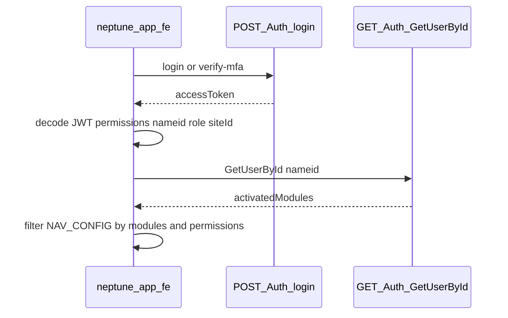

# neptune-app-fe — Sidebar Navigation Guide

How the **main EHSS user dashboard** (`neptune-app-fe`) should decide which sidebar items to show.

This app is separate from **neptune-admin-fe** (the platform/org admin portal in this repo). Both share the same Neptune API (`NEXT_PUBLIC_API_URL` / `.docs/swagger.json`).

---

## Rule of thumb

Show a nav item only when **both** are true:

1. **Org module** — the company has licensed that EHSS module (`activatedModules`).
2. **User permission** — the signed-in user's role grants the required permission(s).

```
visible = orgHasModule(moduleCode) AND userHasPermission(requiredPermissions)
```

Users with role **`Admin`** bypass permission checks on the backend. The UI may show all **licensed** modules for Admin, or apply the same permission filter — product choice.

---

## Module codes (backend format)

Admin sends modules as a comma-separated string of **uppercase snake_case** codes (see [`src/lib/ehs-modules.ts`](../src/lib/ehs-modules.ts)):

| Display name | API code |
| --- | --- |
| Incident | `INCIDENT` |
| Near Miss | `NEAR_MISS` |
| Hazard | `HAZARD` |
| Lockout/Tagout | `LOCKOUT_TAGOUT` |
| CAPA | `CAPA` |
| Audits | `AUDITS` |
| Inspections | `INSPECTIONS` |
| Policy Maker | `POLICY_MAKER` |
| Regulatory Compliance | `REGULATORY_COMPLIANCE` |
| Behaviour Based Safety | `BEHAVIOUR_BASED_SAFETY` |
| Walk and Talks | `WALK_AND_TALKS` |
| PPE Management | `PPE_MANAGEMENT` |
| Industrial Hygiene | `INDUSTRIAL_HYGIENE` |
| Hazcom | `HAZCOM` |

Parse with the same helpers as admin-fe: split on `,`, trim, compare case-insensitively.

---

## Which APIs to use

### 1. User permissions — JWT from login (primary)

**Endpoints**

- `POST /api/Auth/login`
- `POST /api/Auth/verify-mfa` (when MFA is required)

**Source:** the **`accessToken`** in the response body.

Tenant session JWT claims (from [AdminDashboard-fe-guide.md](./AdminDashboard-fe-guide.md)):

| Claim | Use |
| --- | --- |
| `nameid` | Current user id → `GetUserById` |
| `OrganizationName` | Tenant context |
| `SiteId` | Site context |
| `role` | e.g. `Admin` — bypasses permission gates server-side |
| `Permission` | **One claim per granted permission** — use for sidebar gating |

Decode the JWT client-side (same approach as [`src/lib/auth-redirect.ts`](../src/lib/auth-redirect.ts) `parseJwtPayload`). Collect every `Permission` claim into a `Set<string>`.

**No extra API call** is required for the current user's permissions if the token is issued with permission claims (standard tenant login flow).

---

### 2. Org activated modules — `GET /api/Auth/GetUserById/{id}`

**Endpoint:** `GET /api/Auth/GetUserById/{id}`

**Auth:** Bearer `accessToken` from login.

**Path:** `{id}` = user id from JWT `nameid`.

**Read:** `dataModel.activatedModules` — comma-separated module codes, e.g. `"INCIDENT,HAZARD,CAPA"`.

Swagger schema [`UserDto`](./swagger.json) includes `activatedModules`. This is the best **tenant-user-facing** source for licensed modules today.

```ts
// After login
const payload = parseJwtPayload(accessToken);
const userId = payload.nameid;

const { dataModel } = await api.get(`/Auth/GetUserById/${userId}`);
const modules = parseActivatedModuleCodes(dataModel.activatedModules);
// → Set of "INCIDENT", "HAZARD", ...
```

Reuse parsing from admin-fe:

```ts
import { parseActivatedModuleCodes } from "@/lib/ehs-modules"; // or copy the helper
```

---

### 3. Permission catalog (build-time / admin tooling only)

**Not for runtime “my sidebar” filtering.**

| Endpoint | Purpose |
| --- | --- |
| `GET /api/SuperAdminRoles/permissions` | Full permission list; each item may include `module`, `displayName`, `categoryName`. Use when **building** the static nav config (map routes → permission names). |
| `GET /api/Auth/all-Permissions` | Tenant permission catalog — not “current user”. |
| `GET /api/Auth/AllRolesPermissions` | All roles + permissions in org — not current session. |

---

## APIs that are NOT for neptune-app-fe sidebar

| API | Why |
| --- | --- |
| `GET /api/SuperAdminDashboard/summary` | **neptune-admin-fe** org dashboard; `activatedModules.modules` is for admin portal KPIs, not end-user app bootstrap. |
| `GET /api/SuperAdminCompanies/{organizationId}` | Super-admin **staff** token only. |
| `PUT /api/SuperAdminCompanies/{organizationId}/modules` | Writes modules; does not read session. |

---

## Bootstrap flow (recommended)



**On app load (after token exists):**

1. Decode JWT → `permissions`, `nameid`, `role`, `siteId`.
2. `GET /Auth/GetUserById/{nameid}` → `activatedModules`.
3. Build sidebar from static `NAV_CONFIG` filtered by both.

**On login:** store token, run bootstrap once, cache in React Query / context (`staleTime` ~ session length).

**On 401:** clear token, redirect to login.

---

## Static nav config pattern

Keep a single catalog in `neptune-app-fe` (e.g. `src/lib/app-nav.ts`):

```ts
export type AppNavItem = {
  label: string;
  href: string;
  icon: string;
  moduleCode: string;            // e.g. "INCIDENT"
  requiredPermissions: string[];   // e.g. ["View Incidents"] — any match shows item
};

export const APP_NAV_ITEMS: AppNavItem[] = [
  {
    label: "Incidents",
    href: "/incidents",
    icon: "lucide:alert-triangle",
    moduleCode: "INCIDENT",
    requiredPermissions: ["View Incidents"],
  },
  {
    label: "Hazards",
    href: "/hazards",
    icon: "lucide:shield-alert",
    moduleCode: "HAZARD",
    requiredPermissions: ["Manage Hazards"], // align with backend permission names
  },
  // ...
];
```

Filter helper:

```ts
export function getVisibleNavItems(
  items: AppNavItem[],
  activatedModules: Set<string>,
  userPermissions: Set<string>,
  role: string | null,
): AppNavItem[] {
  return items.filter((item) => {
    if (!activatedModules.has(item.moduleCode.toUpperCase())) return false;
    if (role === "Admin") return true;
    return item.requiredPermissions.some((p) => userPermissions.has(p));
  });
}
```

Align `requiredPermissions` with names returned in JWT / `GET /SuperAdminRoles/permissions` (`displayName` or `permissionName` — confirm against a live token once).

---

## JWT helper (permissions from token)

```ts
export function getPermissionsFromToken(token: string): Set<string> {
  const payload = parseJwtPayload(token);
  if (!payload) return new Set();

  const permissions = new Set<string>();

  // Single claim or array depending on issuer
  const raw = payload.Permission ?? payload.permission;
  if (typeof raw === "string") permissions.add(raw);
  if (Array.isArray(raw)) raw.forEach((p) => typeof p === "string" && permissions.add(p));

  // Some issuers repeat the claim key (ASP.NET multiple claims)
  for (const [key, value] of Object.entries(payload)) {
    if (key.toLowerCase() === "permission" && typeof value === "string") {
      permissions.add(value);
    }
  }

  return permissions;
}
```

Verify claim shape against a real login token in your environment and adjust parsing once.

---

## Backend gap (optional improvement)

There is **no** single session bootstrap endpoint today, e.g.:

```
GET /api/Auth/me
→ { id, role, permissions[], activatedModules, siteId, organizationName }
```

Until that exists, `neptune-app-fe` needs:

| Data | Source |
| --- | --- |
| Permissions | JWT |
| Activated modules | `GET /Auth/GetUserById/{nameid}` |

Ask backend for `/Auth/me` if you want one round-trip after login.

---

## Contrast: neptune-admin-fe (this repo)

Org admin sidebar ([`src/lib/admin-sidebar.ts`](../src/lib/admin-sidebar.ts)) is **static** today.

To drive admin sidebar from licensed modules only:

- **`GET /api/SuperAdminDashboard/summary`** → `dataModel.activatedModules.modules`
- Requires org-scoped token (after super-admin `select-company` or tenant admin login).

Super-admin **staff** org tokens carry **no permission claims** — do not gate super-admin navigation on JWT permissions ([AdminDashboard-fe-guide §1.7](./AdminDashboard-fe-guide.md)).

---

## Test checklist

- [ ] User with `INCIDENT` in `activatedModules` + `View Incidents` permission → Incidents nav visible.
- [ ] Module licensed but no permission → nav hidden (unless Admin).
- [ ] Permission granted but module not licensed → nav hidden.
- [ ] Admin role → all licensed modules visible (if using Admin bypass in UI).
- [ ] After org admin changes modules in admin portal, user sees updated nav after re-fetch `GetUserById` or re-login.
- [ ] 403 on a module route → do not remove nav solely from 403; fix role/module assignment in admin.

---

## Related docs

- [AdminDashboard-fe-guide.md](./AdminDashboard-fe-guide.md) — auth tokens, tenant vs super-admin, dashboard summary API
- [swagger.json](./swagger.json) — full API contract
- [`src/lib/ehs-modules.ts`](../src/lib/ehs-modules.ts) — canonical module labels and API codes (admin-fe)
